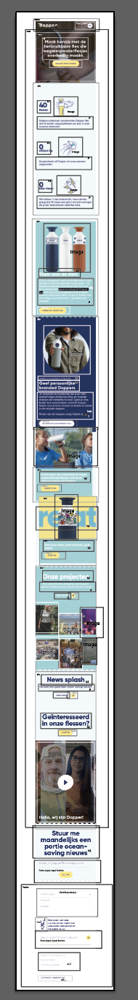
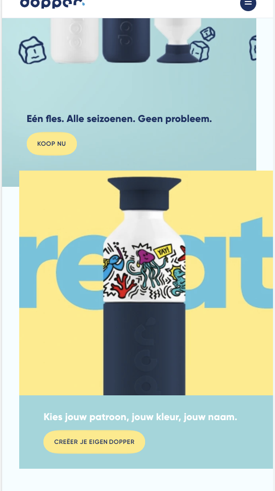

# Procesverslag
Markdown is een simpele manier om HTML te schrijven.  
Markdown cheat cheet: [Hulp bij het schrijven van Markdown](https://github.com/adam-p/markdown-here/wiki/Markdown-Cheatsheet).

Nb. De standaardstructuur en de spartaanse opmaak van de README.md zijn helemaal prima. Het gaat om de inhoud van je procesverslag. Besteedt de tijd voor pracht en praal aan je website.

Nb. Door *open* toe te voegen aan een *details* element kun je deze standaard open zetten. Fijn om dat steeds voor de relevante stuk(ken) te doen.

## Jij

uitwerken voor kick-off werkgroep

### Auteur:
Ilse Grootjes

#### Je startniveau:
blauw

#### Je focus:
Service plane
 

## Je website

uitwerken voor kick-off werkgroep

### Je opdracht:
https://dopper.com/nl 

#### Screenshot(s) van de eerste pagina (small screen): 
hier de naam van de pagina  

#### Screenshot(s) van de tweede pagina (small screen):
hier de naam van de pagina  

 

## Breakdownschets (week 1)

uitwerken na afloop 2e werkgroep

### de hele pagina: 

## Voortgang 1 (week 2)

uitwerken voor 1e voortgang

### Stand van zaken
Ik vind het moeilijk om te zien wanneer ik met flexbox of met positioneren moet werken. 

### Agenda voor meeting
samen met je groepje opstellen

Ik wilde graag weten hoe ik mijn sections het beste kon stylen. Vooral bij de 2 sections die niet onder elkaar staan.

### Verslag van meeting
hier na afloop snel de uitkomsten van de meeting vastleggen

- Ik weet nu hoe ik de sections moet stylen.
- Ik weet hoe ik 'prettier' kan gebruiken
- Ik moet beginnen met de header
- De header staan in de body

## Voortgang 2 (week 3)

uitwerken voor 2e voortgang

### Stand van zaken
Ik vond het moeilijk om te bepalen hoe ik nu door moest gaan. Naar mijn idee zijn de dingen die ik nu nog moet doen veel ingewikkelder dan de dingen die ik nu gedaan heb. Dus ik had tijdens de les ff een opzetje nodig haha.

### Agenda voor meeting

Ik heb deze week nog niet echt specifieke vragen. Misschien dat ik even wil kijken of de manier waar ik mijn headers neer zet.

### Verslag van meeting
hier na afloop snel de uitkomsten van de meeting vastleggen

- Ik heb geleerd hoe ik een icoon in een button kan zetten.
- Ik moet nog een keer de animatie oefeningen goed doornemen

## Toegankelijkheidstest (week 4)

uitwerken na test in 8e voortgang

### Bevindingen
Lijst met je bevindingen die in de test naar voren kwamen:

#### Kleur
De kleuren op het scherm zijn goed in contrast. Hier ben ik achter gekomen met de gele bril. Het enige wat er nog veranderd moet worden is de witte tekst op een gele achtergrond. Hierdoor is het beter te lezen

#### Titel Tekstgrootte. 
De letters zijn door 2 brillen, en bij de concentratie test niet goed te lezen. Daarvoor zouden de p'tjes en ondertitels een stukje groter kunnen.

#### Buttons 
De oplossing voor de moterieke test is lastig als je op een website veel content wilt plaatsen. Ik denk dat dat bij mij wel mee valt. De buttons kunnen misschien wat groter om de button beter te kunnen raten

## Voortgang 3 (week 4)

uitwerken voor 3e voortgang

### Stand van zaken
Ik ben best goed op weg. Ik moet alleen nog de buttons stylen, en iets animeren.

### Agenda voor meeting
samen met je groepje opstellen

Wat kan ik animeren?
Hoe werkt mn loop filmpje in de eerste section?
Hoe kan ik een makkelijke versie maken van de buttons van de site?

### Verslag van meeting
hier na afloop snel de uitkomsten van de meeting vastleggen

- Ik heb met Zaid lang gewerkt aan mijn button
- Ik weet hoe ik mn filmpje in de eerste section kan maken.

## Bronnenlijst

continu bijhouden terwijl je werkt

Nb. Wees specifiek ('css-tricks' als bron is bijv. niet specifiek genoeg).

1. https://flexboxfroggy.com/#nl 
2. https://codepen.io/shooft/pen/zYzdMwO (animaties)
3. https://codepen.io/shooft/pen/mdwroZE (humpty)
4. https://www.w3schools.com/howto/howto_css_zoom_hover.asp 
5. https://shop.dopper.com/nl_gl=1*gjfsj5*_ga*MTY5NzY5ODIyMC4xNjMxMDIyODE1*_ga_CCQ8WWERJQ*MTYzMjkyMDI1NC4xNi4xLjE2MzI5MjAyOTEuMjM. 

